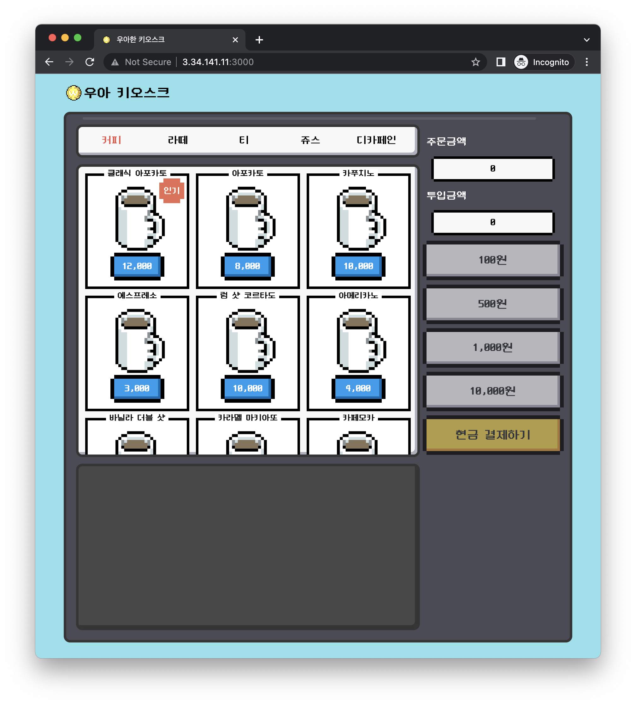
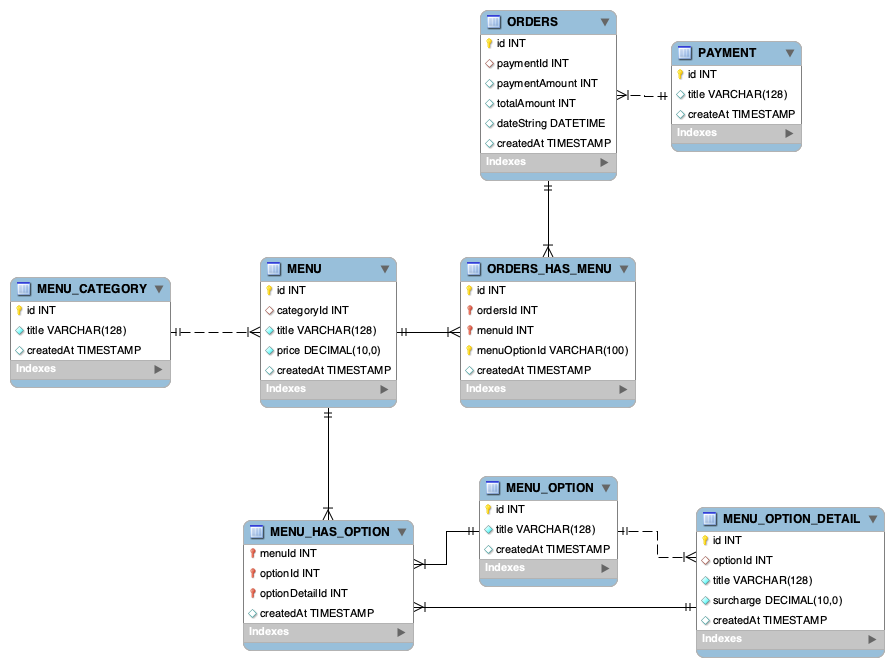

<!-- PROJECT LOGO -->
<br />
<div align="center">
  <a href="https://github.com/woowa-techcamp-2022/web-kiosk-yeonjeong">
    
  </a>

  <h3 align="center">우아 키오스크</h3>

  <p align="center">
    2022 우아한테크캠프 5,6주차 미션 우아 키오스크입니다.
    <br />
    <br />
    <a href="http://3.34.141.11:3000/">👀 View Demo</a>
    <br>
    <a href="http://3.34.141.11:3080/api-docs">🎾 API docs</a>
  </p>
</div>


<!-- ABOUT THE PROJECT -->
## About The Project

[](http://3.34.141.11:3000/)

2022 우아한 테크캠프 5,6주차 미션 우아 키오스크입니다.
메뉴를 선택해서 주문한 뒤 영수증을 조회할 수 있는 프로그램입니다.


### Built With

* []()
* [](https://reactjs.org/)
* [](https://www.typescriptlang.org/)
* 
* [](https://swagger.io/)


<!-- GETTING STARTED -->
## Getting Started

### Prerequisites

* npm
  ```sh
  npm install npm@latest -g
  ```

### Installation

1. Clone the repo
   ```sh
   git clone https://github.com/woowa-techcamp-2022/web-kiosk-yeonjeong.git
   ```
2. Install NPM packages
   ```sh
   npm install

   cd client
   npm install

   cd server
   npm install
   ```
3. DB configuration (`/server/.env`)
   ```
   MYSQL_HOST=
   MYSQL_USER=
   MYSQL_PW=
   MYSQL_DB=
   ```

### ERD



<!-- ACKNOWLEDGMENTS -->
## Acknowledgments

* [Pure CSS 8bit Button Style](https://codepen.io/MatthewShields/pen/pwrXpV)
* [ebOy](https://www.eboy.com/pool/everything/1)
* [Neo둥근모](https://neodgm.dalgona.dev/)
* [NES.css](https://github.com/nostalgic-css/NES.css)
